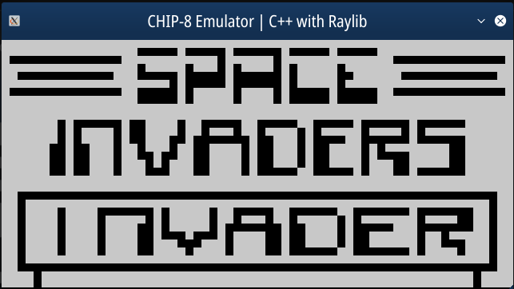

# CHIP-8 with Raylib

This is a complete CHIP-8 interperator created as per the specification located
here: https://en.wikipedia.org/wiki/CHIP-8.



It has been created in C++ with Raylib and is verified to work on Linux.  
You will need to install the following in order to build the program:

- https://github.com/RobLoach/raylib-cpp (cpp raylib bindings / Rob Loach)  
- https://github.com/raysan5/raylib (cpp raylib is a header-only library; must be linked to raylib)  
- https://gcc.gnu.org/ (Tested with version 8.3.0)  

## How to build

1. Download and install the above prerequisites.
2. create a 'roms' folder in the bin folder and add your own, legally acquire,
roms into it.
3. Update the 'load ROM' function on line 21 of cpu.cpp to point to your ROM. (I will make this more user friendly later)
4. run the following command:

```
g++ -o bin/CHIP8 src/*.cpp  -std=c++17 -Iinclude -g -LPATH-TO:libraylib.a -lraylib -l GL -l m -l pthread -l dl -l rt -l X11
```

Sadly I was not getting on very well with Makefiles so this will have to do for now!

## Reasons for building

I am interested in lower level programming and video games. I figured building
a CHIP-8 emulator might be a good entry point to understanding how to go about
emulating more complex systems.

## Resources

http://mattmik.com/files/chip8/mastering/chip8.html

https://tobiasvl.github.io/blog/write-a-chip-8-emulator/

https://en.wikipedia.org/wiki/CHIP-8

http://www.codeslinger.co.uk/files/emu.pdf — Victor Moya del Barrio, 2001.

https://www.raylib.com/cheatsheet/cheatsheet.html

https://github.com/RobLoach/raylib-cpp

https://raylibtech.itch.io/rfxgen — Used to create the sound effect. 
